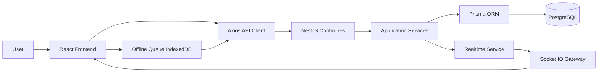
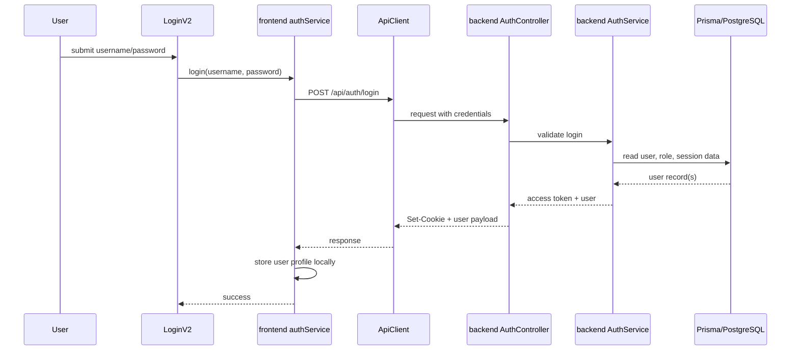

# SYSTEM FOUNDATIONS 3-STEP REPORT

Date: 2026-03-21
Project: MZ.S-ERP
Scope: Foundational architectural assessment, 7-day improvement plan, and end-to-end data flow mapping.

## Executive Summary

This report executes the three requested steps in order:

1. Architecture maturity scorecard with a numeric grade and evidence-based rationale.
2. A 7-day improvement plan focused on the highest-value structural fixes.
3. A detailed data-flow map from UI interaction to API, database, offline queue, and realtime propagation.

Current overall assessment:

- Overall maturity score: 73/100
- Current grade: B-
- General conclusion: The system is structurally viable and already demonstrates strong modular intent, a meaningful domain model, and an operational deployment path. It is not yet at a clean production-grade baseline because several critical rules are enforced primarily on the client, the backup implementation is still aligned with SQLite while the active schema targets PostgreSQL, legacy local-auth remnants still exist in the frontend, and maintainability is reduced by text-encoding damage and very large UI components.

Primary conclusion:

- The project has a solid enterprise direction.
- The backend module structure is stronger than the frontend composition quality.
- The data model is one of the strongest parts of the system.
- The biggest architectural risks are consistency risks, not feature gaps.

Key verified evidence used in this report includes:

- `backend/src/app.module.ts`
- `backend/src/main.ts`
- `backend/prisma/schema.prisma`
- `backend/src/auth/auth.controller.ts`
- `backend/src/auth/auth.service.ts`
- `backend/src/transaction/transaction.controller.ts`
- `backend/src/transaction/transaction.service.ts`
- `backend/src/backup/backup.service.ts`
- `backend/src/realtime/realtime.gateway.ts`
- `backend/src/realtime/realtime.service.ts`
- `frontend/src/App.tsx`
- `frontend/src/components/LoginV2.tsx`
- `frontend/src/components/DailyOperations.tsx`
- `frontend/src/components/Stocktaking.tsx`
- `frontend/src/api/client.ts`
- `frontend/src/services/authService.ts`
- `frontend/src/services/authController.ts`
- `frontend/src/services/transactionsService.ts`
- `frontend/src/hooks/useOfflineSync.ts`
- `frontend/src/services/mutationQueueService.ts`
- `frontend/src/store/useInventoryStore.ts`
- `docker-compose.yml`
- `nginx.prod.conf`
- `package.json`

---

## Step 1: Architecture Scorecard

### 1.1 Scoring Method

The scorecard below evaluates the system across nine axes. Each axis is weighted by foundational impact on correctness, production viability, and long-term maintainability.

| Axis | Weight | Score | Result |
| --- | ---: | ---: | --- |
| Module boundaries and separation of concerns | 15 | 13 | Strong |
| Domain model and persistence design | 15 | 13 | Strong |
| API contract and client integration | 10 | 8 | Good |
| Security and IAM posture | 15 | 10 | Mixed |
| Runtime and deployment readiness | 15 | 10 | Mixed |
| Business-rule enforcement | 10 | 7 | Acceptable but incomplete |
| Observability and realtime behavior | 8 | 6 | Good baseline |
| Maintainability and code health | 7 | 4 | Needs work |
| Testing and release confidence | 5 | 2 | Weak |
| **Total** | **100** | **73** | **B-** |

### 1.2 Detailed Evaluation by Axis

#### 1. Module Boundaries and Separation of Concerns

Score: 13/15

Why it scores well:

- The backend is organized as explicit NestJS modules: auth, backup, opening-balance, item, monitoring, report, reports, transaction, users, dashboard, realtime.
- The root composition in `backend/src/app.module.ts` is coherent and follows a modular monolith shape.
- Frontend responsibilities are partially separated into components, services, hooks, store, and API client.

Why it does not score higher:

- Two frontend files are carrying too much orchestration responsibility: `frontend/src/App.tsx` and `frontend/src/components/DailyOperations.tsx`.
- Some business logic, data hydration, auth bootstrapping, local persistence, and cross-cutting concerns are still aggregated in component-level code.

Impact:

- The system is expandable.
- Change cost is currently uneven: backend changes are safer than major frontend workflow changes.

#### 2. Domain Model and Persistence Design

Score: 13/15

Why it scores well:

- `backend/prisma/schema.prisma` defines a meaningful enterprise data model.
- Core entities are present and appropriately separated: users, roles, permissions, invitations, active sessions, audit logs, items, opening balances, transactions.
- Several indexes are already present where they matter: audit dimensions, item search fields, transaction dates and types.

Why it does not score higher:

- The backup implementation still assumes SQLite file-based backup semantics, while the active Prisma datasource is PostgreSQL.
- This means the data model itself is stronger than the operational data-protection implementation around it.

Impact:

- The logical model is production-capable.
- Disaster recovery correctness is currently behind persistence design quality.

#### 3. API Contract and Client Integration

Score: 8/10

Why it scores well:

- The Axios client in `frontend/src/api/client.ts` normalizes API prefixing and credentials handling.
- Transaction routes are clear and coherent: list, getById, create, bulk create, import, migrate, update, delete.
- `frontend/src/services/transactionsService.ts` acts as a normalization layer between server payloads and frontend transaction shape.

Why it does not score higher:

- The app still contains legacy/hybrid paths and historical compatibility layers.
- The transaction service includes fallback behavior such as PATCH retry after PUT failure, which is practical but indicates contract drift across versions.

Impact:

- Day-to-day feature work is feasible.
- Contract discipline is not yet fully strict.

#### 4. Security and IAM Posture

Score: 10/15

Why it scores well:

- Backend login uses server-side authentication and sets an HTTP-only cookie in `backend/src/auth/auth.controller.ts`.
- `backend/src/main.ts` enforces JWT secret presence, rate limiting, global prefixing, and CORS handling.
- Role and permission concepts are first-class in schema and backend logic.

Why it does not score higher:

- The frontend still contains `frontend/src/services/authController.ts`, a legacy local-auth implementation with browser-side credential handling and local audit-style persistence.
- The active login path is server-first through `frontend/src/components/LoginV2.tsx` and `frontend/src/services/authService.ts`, but the presence of local-auth remnants increases cognitive and security complexity.
- The app still relies on locally stored auth user profile state with no dedicated `GET /auth/me` bootstrap endpoint.

Impact:

- Security direction is correct.
- Security authority is not yet fully centralized.

#### 5. Runtime and Deployment Readiness

Score: 10/15

Why it scores well:

- Root scripts support workspace-level dev and production execution.
- `docker-compose.yml` orchestrates PostgreSQL, backend, frontend, and nginx with health checks.
- `nginx.prod.conf` correctly proxies `/api/` and `/socket.io/` and adds useful security headers.

Why it does not score higher:

- `backend/src/backup/backup.service.ts` resolves database backups through a SQLite file path strategy, which conflicts with the live PostgreSQL datasource declared in Prisma.
- This mismatch weakens trust in backup/restore behavior under production deployment.
- Some operational logic still reflects migration history rather than a finalized platform contract.

Impact:

- The app can run.
- Its business continuity path is not yet trustworthy enough without correction.

#### 6. Business-Rule Enforcement

Score: 7/10

Why it scores well:

- Blind stocktaking mode is visibly implemented in `frontend/src/components/Stocktaking.tsx`.
- Day-rollover duration logic is implemented in `frontend/src/components/DailyOperations.tsx` using `calculateDurationWithRollover`.
- Transaction stock deltas are enforced server-side in `backend/src/transaction/transaction.service.ts` through atomic Prisma transactions.

Why it does not score higher:

- Key timing and penalty calculations are still primarily computed in the frontend and then submitted to the backend as values.
- The backend persists these fields but does not appear to recompute or authoritatively validate them.
- That means critical business rules are supported, but not yet server-enforced.

Impact:

- The user workflow behaves correctly in the happy path.
- The backend is not yet the single source of truth for all important calculations.

#### 7. Observability and Realtime Behavior

Score: 6/8

Why it scores well:

- `backend/src/main.ts` exposes a Prometheus-style `/metrics` endpoint.
- HTTP request logging is structured enough to support monitoring.
- `backend/src/realtime/realtime.service.ts` and `backend/src/realtime/realtime.gateway.ts` broadcast sync events after transaction mutations.

Why it does not score higher:

- Observability is present, but not yet broad enough to cover business-level counters, backup outcomes, queue backlog pressure, or auth/session quality signals in a complete way.

Impact:

- Operators can see whether the system is alive.
- They still cannot see enough to diagnose subtle correctness issues quickly.

#### 8. Maintainability and Code Health

Score: 4/7

Why it scores well:

- There is a visible pattern of incremental hardening and refactoring.
- Services and stores are already used in several places instead of purely inline logic.

Why it does not score higher:

- Mojibake and text-encoding corruption are still visible in comments and user-facing strings across multiple files.
- Some components are too large and mix view logic, validation, data orchestration, printing concerns, and offline behavior.
- Legacy compatibility code increases the reading burden.

Impact:

- The system remains understandable.
- It is more expensive to modify safely than it should be.

#### 9. Testing and Release Confidence

Score: 2/5

Why it scores at all:

- There is at least an existing E2E login path and several verification scripts at the root.
- The repository shows an engineering habit of producing validation artifacts.

Why it does not score higher:

- The visible test surface is still too narrow for the complexity of the system.
- Critical correctness behaviors such as stock delta integrity, backup consistency, auth bootstrap, and offline mutation replay need stronger automated coverage.

Impact:

- Manual stabilization appears to have been used frequently.
- Regression risk remains non-trivial.

### 1.3 Strongest Areas

1. Backend modular structure.
2. Prisma domain model and indexing discipline.
3. Transaction stock updates wrapped in server-side database transactions.
4. Realtime event propagation after mutation success.
5. Operational deployment layout with Docker and Nginx.

### 1.4 Highest-Risk Structural Findings

1. Backup logic is operationally inconsistent with the active PostgreSQL datasource because the current backup service still resolves SQLite database files.
2. Business-rule calculations for entry/exit timing and penalties are not yet server-authoritative.
3. Legacy local authentication code still exists in the frontend and should be retired or isolated.
4. Encoding corruption is still present in comments and some strings, reducing maintainability and trust.
5. Large frontend orchestration files will continue to slow safe iteration unless decomposed.

### 1.5 Final Step-1 Conclusion

The architecture is not fragile, but it is still transitional. The system has enough structure to justify continued investment. The next improvement wave should focus on centralizing authority in the backend, removing legacy pathways, and aligning operational tooling with the actual database engine.

---

## Step 2: 7-Day Improvement Plan

### 2.1 Plan Objective

The goal of the next seven days is not to add features. It is to move the system from a transitional but functional state into a stable production-ready baseline with fewer hidden risks and a cleaner operational contract.

### 2.2 Priority Order

This plan is intentionally ordered to remove correctness and operational risks before maintainability polishing:

1. Remove ambiguity and corruption.
2. Make authentication and calculations server-authoritative.
3. Fix backup reliability.
4. Reduce frontend orchestration complexity.
5. Add regression safety nets.

### 2.3 Seven-Day Execution Plan

| Day | Focus | Main Deliverables |
| --- | --- | --- |
| 1 | Encoding and source hygiene | No mojibake in active source paths, text audit completed |
| 2 | Authentication consolidation | Cookie-only auth contract finalized, legacy local auth isolated or removed |
| 3 | Server-side rule authority | Backend recalculates duration, rollover, penalties, and validates submitted values |
| 4 | Backup and restore correction | PostgreSQL-compatible backup/restore path implemented and tested |
| 5 | Frontend decomposition | `App.tsx` and `DailyOperations.tsx` split into focused hooks/services/components |
| 6 | Automated regression coverage | Integration and E2E coverage added for auth, transactions, offline replay, and backups |
| 7 | Production hardening gate | Final verification matrix, smoke checks, release checklist, and operator notes |

### Day 1: Encoding and Source Hygiene

Goal:

- Remove trust-eroding text corruption and prevent it from returning.

Tasks:

- Scan active source files for mojibake and corrupted Arabic strings.
- Normalize file encoding to UTF-8 without BOM where applicable.
- Clean corrupted comments in backend and frontend source.
- Confirm that user-facing text in login, stocktaking, backup, and operations screens renders correctly.
- Add a CI or local validation step based on the existing encoding script approach.

Files to prioritize:

- `backend/src/app.module.ts`
- `backend/src/auth/auth.service.ts`
- `backend/src/backup/backup.service.ts`
- `frontend/src/components/DailyOperations.tsx`
- `frontend/src/components/Stocktaking.tsx`
- `frontend/src/services/transactionsService.ts`

Definition of done:

- No visible corrupted Arabic text remains in active runtime code.
- The encoding-check script can catch regressions.

Why this comes first:

- It reduces risk immediately and makes all following refactors safer to review.

### Day 2: Authentication Consolidation

Goal:

- Make backend auth the only authority and remove lingering dual-mode behavior.

Tasks:

- Keep `LoginV2` and `authService` as the primary login path.
- Retire, fence off, or archive `frontend/src/services/authController.ts` if it is no longer part of the supported flow.
- Add a backend session bootstrap endpoint such as `GET /auth/me`.
- Change app bootstrapping in `frontend/src/App.tsx` to validate the session from the server instead of trusting local user state first.
- Ensure logout clears both browser state and server cookie contract consistently.

Files to prioritize:

- `backend/src/auth/auth.controller.ts`
- `backend/src/auth/auth.service.ts`
- `frontend/src/components/LoginV2.tsx`
- `frontend/src/services/authService.ts`
- `frontend/src/App.tsx`
- `frontend/src/services/authController.ts`

Definition of done:

- There is one supported auth path.
- Page refresh and fresh browser sessions resolve the current user from the backend, not only from local storage.

Why this matters:

- Security and user-state correctness become easier to reason about.

### Day 3: Server-Side Rule Authority

Goal:

- Move critical business calculations from client convenience to backend truth.

Tasks:

- Add shared or backend-native utilities for time normalization and rollover duration calculation.
- Recalculate `difference`, `delayDuration`, `delayPenalty`, and `calculatedFine` on the backend when transaction payloads are created or updated.
- Treat frontend-calculated values as hints, not truth.
- Validate required rule relationships such as `entryTime`, `exitTime`, and `unloadingRuleId`.
- Add server tests for same-day and next-day rollover scenarios.

Files to prioritize:

- `backend/src/transaction/transaction.service.ts`
- `backend/src/transaction/dto/*.ts`
- `frontend/src/components/DailyOperations.tsx`

Definition of done:

- Server output remains correct even if the client submits incomplete or manipulated timing values.

Why this matters:

- This is a direct correctness improvement, not just cleanup.

### Day 4: Backup and Restore Correction

Goal:

- Align backup behavior with the real database engine and make disaster recovery credible.

Tasks:

- Replace SQLite file-path backup assumptions with PostgreSQL-aware backup logic.
- Decide on the backup format: SQL dump, logical export, or controlled DB snapshot strategy.
- Keep scheduling asynchronous as required, but ensure actual database content is captured.
- Validate restore preview and restore execution against the real data source.
- Add checksum, manifest, and restore tests for the PostgreSQL path.

Files to prioritize:

- `backend/src/backup/backup.service.ts`
- `docker-compose.yml`
- environment contract documentation

Definition of done:

- Full backup and restore work against PostgreSQL, not only historical SQLite assumptions.

Why this matters:

- This is the single most important operational risk discovered in this review.

### Day 5: Frontend Decomposition

Goal:

- Reduce the size and responsibility concentration of the main orchestration files.

Tasks:

- Split `frontend/src/App.tsx` into focused bootstrapping hooks: auth bootstrap, audit bootstrap, reference-data bootstrap, and local persistence sync.
- Split `frontend/src/components/DailyOperations.tsx` into modules for print logic, import logic, invoice builder, stock validation, and time calculation helpers.
- Move business utilities into `services` or `utils` with tests.
- Keep current behavior stable while improving boundaries.

Definition of done:

- Component files become materially smaller.
- Shared logic becomes testable outside the render tree.

Why this matters:

- It lowers future feature cost and debugging time.

### Day 6: Automated Regression Coverage

Goal:

- Add release confidence for the highest-risk flows.

Tests to add or strengthen:

- Auth login and refresh/session bootstrap.
- Transaction creation updates stock correctly.
- Transaction update and delete reverse stock deltas correctly.
- Rollover timing and penalty calculations.
- Offline queue replay order and conflict behavior.
- Backup manifest integrity and restore preview flow.

Preferred layers:

- Backend integration tests for services and controllers.
- Frontend unit tests for helper logic.
- E2E tests for login and one transaction lifecycle.

Definition of done:

- The most failure-prone flows are covered by automated checks.

### Day 7: Production Hardening Gate

Goal:

- Convert all previous work into a release-ready baseline.

Tasks:

- Run full build, smoke, health, and metrics checks.
- Validate Docker startup, health checks, login, transaction creation, and realtime signal propagation.
- Document environment variables, backup expectations, auth contract, and operational runbooks.
- Produce a concise go/no-go checklist.

Definition of done:

- A maintainer can explain how the system authenticates, persists, backs up, syncs offline work, and emits realtime changes without referring to historical assumptions.

### 2.4 Expected Outcome After 7 Days

If the plan is executed in order, expected maturity moves from approximately 73/100 to the low-to-mid 80s, with the largest gains coming from:

- backend authority over business rules
- real backup correctness
- auth-path simplification
- reduced frontend orchestration complexity
- better regression safety

---

## Step 3: Detailed Data Flow Map

### 3.1 High-Level System Flow

Interpretation:

- The dominant happy-path architecture is React -> Axios -> NestJS -> Prisma -> PostgreSQL.
- Realtime is event-based and fed by successful backend mutations.
- Offline writes are queued client-side and replayed when connectivity returns.

### 3.2 Flow A: Login and Session Establishment

#### Actual active path

The active UI login path is server-first.

Sequence:

1. The user submits credentials in `frontend/src/components/LoginV2.tsx`.
2. `LoginV2` calls `login(username, password)` from `frontend/src/services/authService.ts`.
3. `authService` posts to `/auth/login` through `frontend/src/api/client.ts` with `withCredentials: true`.
4. `backend/src/auth/auth.controller.ts` receives the request.
5. `AuthController.login()` calls `AuthService.login(...)`.
6. The backend validates credentials and returns user/session payload.
7. The backend sets `feed_factory_jwt` as an HTTP-only cookie.
8. The response body returns a placeholder token string (`httpOnly`) plus user metadata.
9. The frontend stores the user profile in local storage using `setAuthUser(...)`.
10. `frontend/src/App.tsx` later reads the stored user using `getAuthUser()` during bootstrap.

Sequence diagram:

Important observations:

- The cookie is the real session carrier.
- The user object in local storage is a client-side convenience cache, not the secure credential.
- This is much better than token-in-local-storage auth.
- The design is still incomplete because app bootstrap lacks a dedicated backend session introspection endpoint.

Risk discovered:

- `frontend/src/services/authController.ts` still exists as a legacy browser-side auth path and should not remain a first-class option in a production contract.

### 3.3 Flow B: Application Bootstrap and Data Hydration

Sequence:

1. `frontend/src/App.tsx` starts auth initialization on mount.
2. It loads local browser-side datasets first for several non-item structures such as transactions, partners, orders, tags, settings, and users.
3. It reads the current auth user from `frontend/src/services/authService.ts`.
4. If a user exists locally, the app sets `currentUser` and marks auth as ready.
5. After auth readiness, the app triggers `useInventoryStore.getState().loadAll()`.
6. `frontend/src/store/useInventoryStore.ts` then loads authoritative server-side inventory data through API services such as items, opening balances, transactions, users, and roles.

What this means architecturally:

- Bootstrap is hybrid: it starts from browser state for responsiveness, then hydrates from the server.
- This is fast, but it is also one of the reasons the app still feels transitional.

Key benefit:

- Faster perceived startup and partial resilience.

Key weakness:

- The current user can be accepted locally before full server revalidation.

### 3.4 Flow C: Transaction Creation in Online Mode

Primary path source files:

- `frontend/src/components/DailyOperations.tsx`
- `frontend/src/hooks/useOfflineSync.ts`
- `frontend/src/services/transactionsService.ts`
- `backend/src/transaction/transaction.controller.ts`
- `backend/src/transaction/transaction.service.ts`

Sequence:

1. The user creates transaction data through invoice mode or batch mode inside `DailyOperations.tsx`.
2. The component normalizes times and calculates client-side derived values such as difference and penalties.
3. The component calls `addTransactionsWithOfflineProof(...)`.
4. That function sends a payload to `executeWithSync('/transactions/bulk', 'POST', payload, localAction)` from `useOfflineSync`.
5. In online mode, `executeWithSync` performs the optimistic local action and then issues the live API request.
6. `backend/src/transaction/transaction.controller.ts` routes `POST /transactions/bulk` to `TransactionService.createMany(...)`.
7. `TransactionService.createMany(...)` opens a Prisma transaction.
8. For each row, the backend resolves the item identifier, writes the transaction row, and updates item stock with an increment or decrement based on transaction type.
9. After the DB transaction succeeds, the service emits a realtime sync event through `RealtimeService.emitSync(...)`.
10. The frontend can then react to updated state or realtime notifications.

Important correctness point:

- Stock mutation is enforced server-side inside a database transaction.
- This is one of the strongest design choices in the current system.

Important weakness:

- Time and penalty calculations are currently client-led, not server-authored.

### 3.5 Flow D: Transaction Update and Delete

Update path:

1. The user edits a transaction in `DailyOperations.tsx`.
2. The updated row is sent through the transaction API service.
3. `TransactionService.updateById(...)` reads the existing row.
4. The backend computes old and new stock deltas.
5. If the item changes, it reverses stock on the old item and applies stock to the new item.
6. If the item stays the same, it applies the net delta only.
7. The backend updates the transaction row and then emits `transactions.updated` over realtime.

Delete path:

1. The user deletes one or more transaction IDs.
2. The backend finds the corresponding rows.
3. For each row, it reverses the stock delta.
4. It deletes the DB rows inside a transaction.
5. It emits `transactions.deleted` over realtime if anything was deleted.

Architectural meaning:

- Mutation integrity around stock levels is not superficial; it is embedded in the backend transaction flow.

### 3.6 Flow E: Offline Mutation Queue and Replay

Primary source files:

- `frontend/src/hooks/useOfflineSync.ts`
- `frontend/src/services/mutationQueueService.ts`

Offline flow:

1. `useOfflineSync` detects network status through browser online/offline events.
2. If the app is offline, `executeWithSync(...)` still executes the optimistic local action.
3. Instead of sending the request immediately, it stores the mutation in IndexedDB via `mutationQueueService.enqueue(...)`.
4. If supported, a Background Sync registration is requested from the service worker.
5. When the browser returns online, `handleOnline()` triggers `mutationQueueService.sync()`.
6. The queue is replayed in timestamp order.
7. Successful mutations are removed from the queue.
8. If a conflict returns HTTP 409, the queue logic uses a server-wins strategy and drops the local mutation after notifying the UI.

Why this is valuable:

- The system is designed to preserve intent even under connectivity loss.

Why this is not yet complete:

- Conflict behavior is simple and pragmatic but not domain-rich.
- Stronger operator visibility into queued mutations would improve trust.

### 3.7 Flow F: Realtime Synchronization

Primary source files:

- `backend/src/realtime/realtime.service.ts`
- `backend/src/realtime/realtime.gateway.ts`
- `backend/src/transaction/transaction.service.ts`

Sequence:

1. A backend mutation completes successfully.
2. `TransactionService` calls `RealtimeService.emitSync(...)` with scopes such as `transactions`, `operations`, `dashboard`, `items`, and `stocktaking`.
3. `RealtimeService` forwards the event to the registered gateway bridge.
4. `RealtimeGateway.broadcastSync(...)` emits `inventory:sync` to all connected clients under namespace `/realtime`.
5. Clients connected through Socket.IO can respond by refreshing or reconciling affected views.

Why this is important:

- The backend is the source of realtime truth after persistence succeeds.

Design strength:

- The system emits after commit, not before.

### 3.8 Flow G: Stocktaking and Blind Count

Primary source file:

- `frontend/src/components/Stocktaking.tsx`

Observed behavior:

- The stocktaking screen maintains a `blindMode` state.
- Monthly audit rows are computed from items and transactions.
- The workflow supports session-based monthly counting, reporting, printing, import/export, and conflict-focused filtering.

Architectural meaning:

- Blind count behavior exists in the UI layer and aligns with the project rule.
- As with other core rules, long-term maturity would improve if critical stocktaking workflow rules were also validated server-side where applicable.

### 3.9 Flow H: Backup and Restore

Primary source file:

- `backend/src/backup/backup.service.ts`

Current designed flow:

1. The backup service maintains a backup workspace and manifest.
2. It supports schedule state, retention, encryption, restore preview tokens, integrity verification, and safety snapshots.
3. It can create backups manually or on a schedule using an internal interval-based scheduler.
4. It supports restore preview, restore PIN validation, and final restore execution.

Critical architectural mismatch discovered:

- The active schema uses PostgreSQL.
- The backup service resolves database content through `resolveSqliteDbPath()` and file-based database reads/restores.
- That means backup logic still reflects an earlier SQLite architecture.

Consequences:

- The backup feature may look operationally complete while actually being misaligned with the real persistence engine.
- This is a high-priority architectural correction item.

### 3.10 Data Authority Map

The current authority model is split as follows:

| Concern | Current Main Authority | Assessment |
| --- | --- | --- |
| Session credential | Backend cookie | Correct direction |
| Current user bootstrap | Local storage first, backend indirectly later | Needs tightening |
| Transaction stock delta | Backend | Strong |
| Time and penalty calculations | Frontend | Should move server-side |
| Item persistence | Backend API + Prisma | Good |
| Offline queue intent | Frontend IndexedDB | Correct for client concern |
| Realtime mutation event | Backend | Good |
| Backup database capture | Mismatched | Must be fixed |

### 3.11 Final Step-3 Conclusion

The system already has a recognizable enterprise data-flow backbone:

- UI intent is translated through service layers.
- Mutations reach backend controllers and services through a normalized API client.
- Stock persistence is handled server-side in database transactions.
- Successful mutations are broadcast to connected clients through realtime events.
- Offline work is queued and replayed.

The architecture becomes significantly stronger once two authority gaps are closed:

1. critical calculations move from client-led to backend-led
2. backup logic is aligned with PostgreSQL rather than legacy SQLite behavior

---

## Final Consolidated Conclusion

The project is not starting from zero. It already contains a meaningful modular backend, a viable domain model, a functioning deployment topology, and a transaction pipeline that correctly protects inventory state on the server.

Its main weaknesses are transitional artifacts:

- leftover legacy auth logic
- backend/runtime assumptions inherited from SQLite history
- frontend-heavy business-rule computation
- encoding damage and oversized orchestration files
- limited automated regression confidence

If the seven-day plan in this report is executed in order, the system should move from a transitional B- platform into a materially more production-ready and easier-to-maintain B+/A- trajectory.

## Recommended Immediate Next Action

If only one change can be started first, start with this sequence:

1. Fix backup alignment with PostgreSQL.
2. Move timing and penalty calculations to the backend.
3. Remove or isolate the legacy browser-side auth controller.

That sequence yields the highest reduction in real operational risk.
